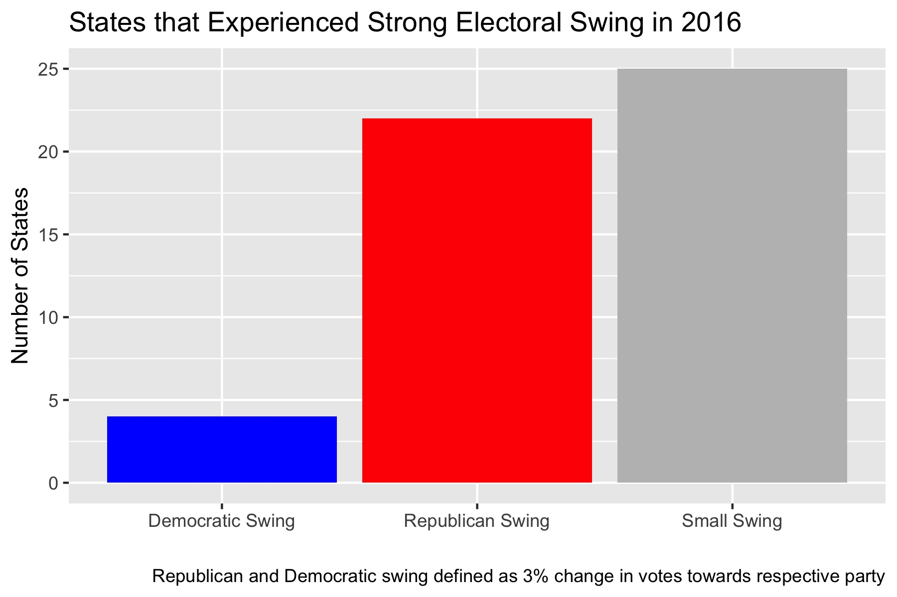
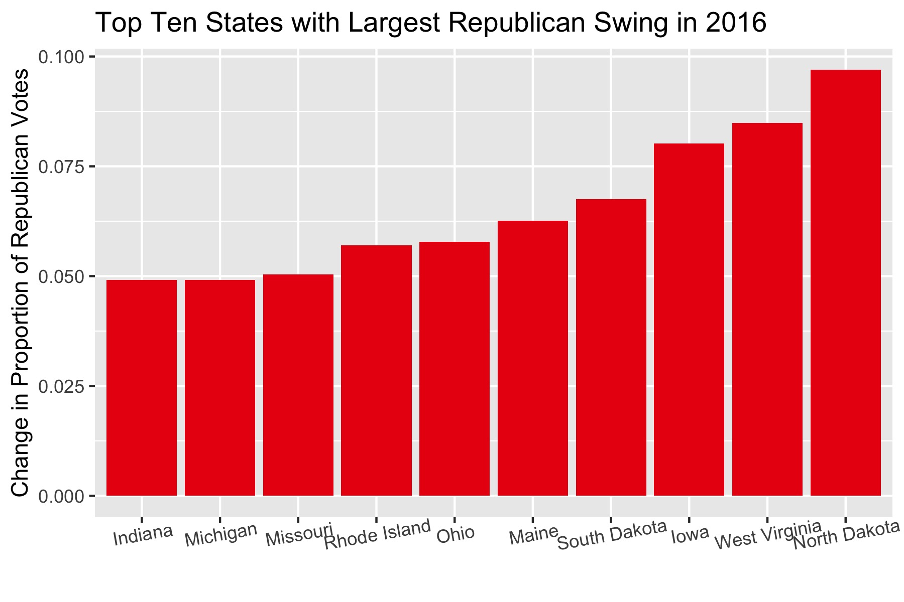

## Electoral Swing in the 2016 U.S. Presidential Election

_By Miroslav Bergam_

_September 11th, 2020_

### How does the U.S. elect presidents?

U.S. Presidential Elections are not determined by a popular vote, which would entail electing the candidate who acquires the higher sum of votes across the nation. Rather, we elect our president using the *Electoral College*. The Electoral College assigns each state a number of electors based on that state's number of Congresspeople. Those electors vote for presidential candidates based on who the majority of their constituency votes for. Each state is ascribed a number of electoral votes based on its size, and our president is decided by whoever wins an absolute majority of these electoral votes. 

### What is electoral swing?

*Electoral swing* is defined by the change in how a state or voting block voted between two elections. It is normal for each state to experience some amount of swing from election to election -- while Americans are more becoming inclined to vote strictly on their [party affiliation](https://www.annualreviews.org/doi/abs/10.1146/annurev.polisci.11.053106.153836), there is obviously still variation based on which candidates the major parties put forward. However, some states are known to shift more strongly and frequently from year to year. These states are called *swing states*.

### Electoral swing in the 2016 presidential election

By subtracting the proportion of Republican votes in each state in the 2012 election from the proportion of Republican votes in each state in the 2016 election, we can see how strongly (and in which direction) each state swung in 2016.

This map visualizes the degree of swing in each state between 2012 and 2016, with darker red colors marking a stronger swing towards votes for the Republican candidate, Trump, and darker blue colors marking a swing towards votes for the Democratic Candidate, Clinton. This can help us see how different regions of the country voted in 2016 compared to 2012: while the West experienced some level of Democratic Swing, most of the country voted more Republican than they did in 2012, particularly in the Midwest. How many states exactly experienced a strong swing in their political direction? It's hard to tell using a map.

We can count the number of states that have a strong swing if we define a strong swing as a 3% change in votes (or a change in proportion of 0.03) in either direction. Overall, far more states swung towards the Republican Party than the Democratic Party in 2016, with the number of states experiencing a strong Republican swing almost matching the number of states that experienced a small swing of under 3%.

These states experienced the largest shifts in the Republican direction between 2012 and 2016. Most of these states are largely rural, which speaks to [Trump's strategy](https://journals.sagepub.com/doi/abs/10.1177/0896920517740615) to appeal to voters in regions of the country that felt neglected or "left behind" in 2016 following the Obama presidency. Additionally, Trump's Electoral College win is largely ascribed to his success in turning voters in the [Midwest](https://www.tandfonline.com/doi/abs/10.1080/00380253.2019.1629847). This is reflected in this graph, as six of these ten states are Midwestern, namely North Dakota, Iowa, South Dakota, Ohio, Michigan and Indiana. 

### Why is this important?

President Trump's ability to swing key states in the Republican direction determined his victory in 2016. Noting which states swung strongly in the previous election and historically is a key strategy in campaigning, as a candidate can focus their resources on regions based on prior voting behavior. This blog will continue to address electoral swing and other topics as we approach the 2020 election.
