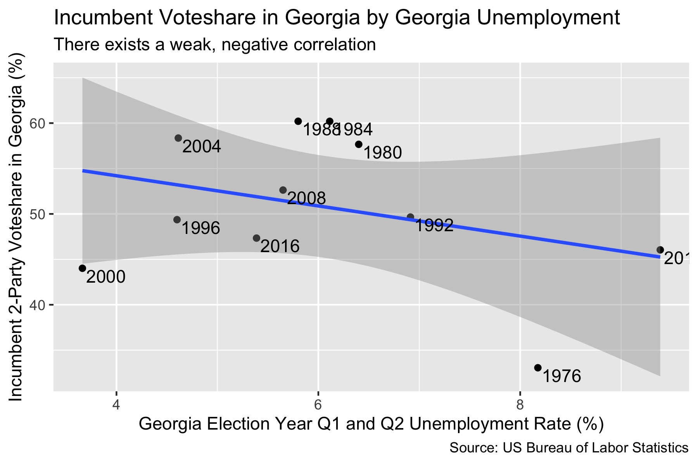
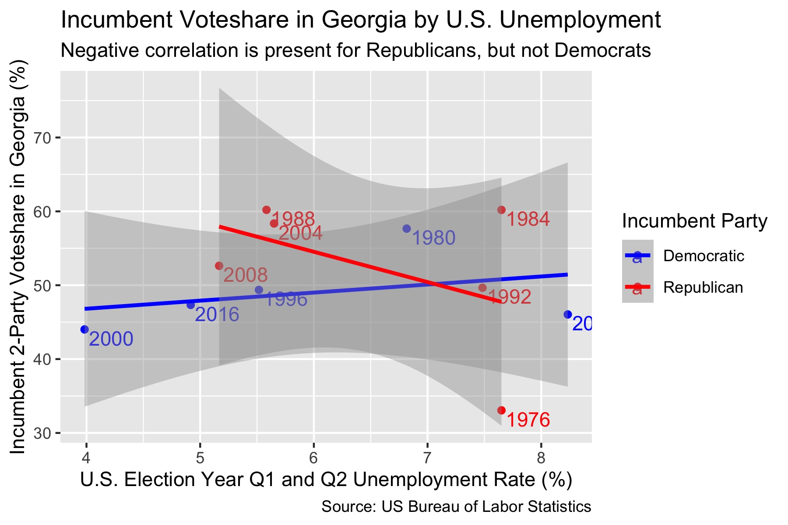
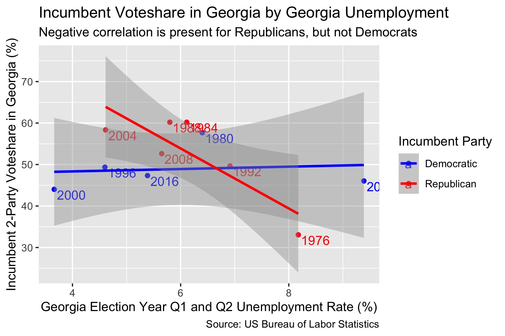

## Do Georgians Care More About the Local or National Economy?

_By Miroslav Bergam_

_September 18th, 2020_

### Voting based on the economy

In presidential elections, do voters in Georgia care more about the local or national economy when assessing the incumbent party's performance in office and casting their vote for a new leader? For which major party does retrospection on the economy matter more in Georgia?

[Retrospective theory](https://hollis.harvard.edu/primo-explore/fulldisplay?docid=TN_cdi_askewsholts_vlebooks_9781400888740&context=PC&vid=HVD2&search_scope=everything&tab=everything&lang=en_US) is the concept of basing one's vote on the results of the previous administration's efforts in office. This practice spares voters of feeling that they cast uninformed votes, as one doesn't need a wealth of technical knowledge to see how things changed under the previous administration. This leads to a level of *retrospective accountability* on the part of the incumbent, who want voters to reflect on their impact positively so they vote for them or their party again. 

One form of retrospective voting is voting based on the economy, as an individual can easily measure how personal, local, or even national finances have changed under the last administration based on a host of metrics. One metric commonly used to determine the economic efficacy of an administration is [unemployment rates](https://www.jstor.org/stable/10.1017/s0022381614000437). 

### Election year or full term?

When assessing unemployment, recent memory wins in the minds of voters. Rather than assessing overall changes in the economy during all four years of the incumbent party's leadership, voters care more about the [last two quarters](https://journals.sagepub.com/doi/abs/10.1177/1532673X01293008) before the election (Q1 and Q2 of election year). This is known as the [end-heuristic](https://hollis.harvard.edu/primo-explore/fulldisplay?docid=TN_cdi_gale_infotracacademiconefile_A354446646&context=PC&vid=HVD2&search_scope=everything&tab=everything&lang=en_US): either subconsciously or for lack of ability to assess long-term economic information, voters substitute a full four-year reflection on the economy for its most recent developments. 

Let's return to our guiding question: do voters in Georgia care more about their state or national economy when choosing who they vote for? To measure this, we'll model the both the unemployment rate of Georgia and the national unemployment rate against the two-party vote share for the incumbent presidential party in Georgia. We will use the average unemployment rate during the first two quarters of the election year as our predictor for both plots because of what we know about voters' tendency to disproportionately weigh the final two quarters of the economy over the last four years. 

### State vs. national unemployment


When modeling the national unemployment rate against Georgia's voteshare for the incumbent presidential party, we can observe a weak, negative correlation. There is a correlation of -0.54, meaning that with each 1% increase in national unemployment, the incumbent party's voteshare decreases by -0.54%. This negative correlation is intuitive: if national unemployment rates are higher at the end of a presidential term, voters in Georgia would be less inclined to vote for that candidate's party again. However, this is a very weak correlation, with an R-squared value of 0.008. We can see if voters care more about state-level unemployment (and if there is a stronger correlation between the two) by replacing the national unemployment rate with Georgia's own unemployment rate as the predictor variable. 



This correlation appears to be slightly stronger and slightly more negative. There is a correlation of -1.67, meaning that with each 1% increase in Georgia's unemployment rate, the incumbent party voteshare decreases by -1.67%. For the same reason as before, this negative relationship makes sense. This model has a R-squared value of 0.11, which is notably stronger than the last relationship but still quite weak. 

### The effect of unemployment on voting by party

Perhaps the effect of unemployment on voting is correlated more strongly with a certain party as the incumbent. Let's graph the same data, but run two linear regressions: one for elections in which the Republican party was incumbent and one for elections in which the Democratic party was incumbent. 



This plot tells us a much different story. The negative correlation seen earlier does not exist for Democratic incumbents, while the correlation is even more negative for Republicans than in the previous model using national unemployment data, with a 4% decrease in Georgian's voteshare for each percentage point of unemployment. The correlation, too, is stronger: an R-squared value of 0.22. 

Let's see how these relationships change when we replace national unemployment with unemployment in Georgia. 



Once again, the correlation for Democrats is no longer negative. However, the correlation for Republicans is even stronger and more negative. For each 1% increase in Georgia's unemployment rate, the incumbent Republican candidate's voteshare in Georgia decreases by 7.23%. This relationship has a moderately strong R-squared of 0.72, notably stronger than any of the previous relationships. 

Both of these graphs align with an interesting finding in [Burden and Wichowsky (2014)](https://www.jstor.org/stable/10.1017/s0022381614000437): that Republican incumbents are more susceptible to a loss of votes due to high unemployment rates, while Democratic incumbents are not susceptible at all.


### Predicting 2020

The formula for the trend line between unemployment in Georgia and Georgian voteshare for Republican incumbents is below:

```
((Georgian voteshare for Republican incumbents) = 97.3 + (Georgian Unemployment Rate) * -7.23)
```

The intercept, 97.3, represents Georgian voteshare for Republican incumbents if the unemployment rate was 0 during the final two quarters of the previous Republican president's term. Alone, this number is counterfactual, as unemployment rates in any state never hit 0 and no state votes so overwhelmingly for one party in a presidential election. As stated before, -7.23, the slope of the trend line, is how much the Republican voteshare in Georgia decreases for each percentage point increase of unemployment. Using this information, we can predict what President Trump's voteshare will be in the 2020 election. 

```
predict(ga_rep_model, newdata = newdata, interval = "prediction")
```

The average unemployment rate in the first two quarters of 2020 in Georgia was 6.7%, heightened by the wave of unemployment following the COVID-19 pandemic. Using our model and the predict() function to generate a prediction interval, we can guess that Trump's voteshare in Georgia will be 48.8% with a lower boundary of 30.1% and an upper boundary of 67.5%. 

48.8% is a reasonable prediction for Trump's voteshare in Georgia, as Georgia is a swing state and voters may respond poorly to recent changes in the economy under his leadership. However, particularly with this election, we must be careful about using old data to predict our new outcome, as COVID-19 has yielded unprecedented changes to our economy that were not present in previous elections.

### Conclusions and Model Limitations

Based on these models, it seems that voters in Georgia care more about state-level unemployment than national unemployment when deciding whether or not to vote for the incumbent party, but only when the incumbent party is Republican. This is in keeping with the findings of [Burden and Wichowsky (2014)](https://www.jstor.org/stable/10.1017/s0022381614000437), which concludes that Republicans incumbents have more to lose from high unemployment rates during their term in office. 

There are several limitations to this model. The first is that these findings cannot be generalized to different states. These models were generated using data on Georgian voters, so while it may be true that several other states experience a similar trend, these analyses must be run on another state's voting data to draw this conclusion. Additionally, most of the relationships in these models had weak R-squared values, with the exception of modeling Georgian unemployment against Republican incumbent vote share. Thus, these findings should be taken cautiously. Individuals rarely vote solely on unemployment rates: these models can be improved and the role of unemployment in voting can be better understood by constructing a more comprehensive model with more predictors.