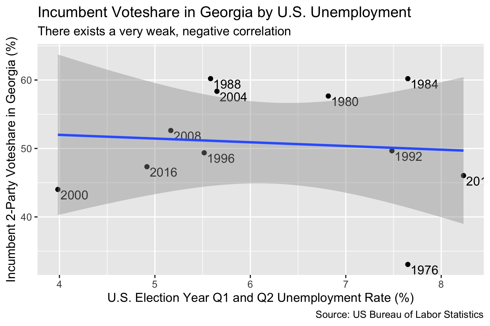

## Local vs National Economy to Predict Voting Behvaior

_By Miroslav Bergam_

_September 18th, 2020_

### Voting based on the economy

Do voters care more about the local or national economy when assessing the incumbent party's performance in office and casting their new vote?

[Retrospective theory](https://hollis.harvard.edu/primo-explore/fulldisplay?docid=TN_cdi_askewsholts_vlebooks_9781400888740&context=PC&vid=HVD2&search_scope=everything&tab=everything&lang=en_US) is the concept of basing one's vote on the results of the previous administration's efforts in office. This practice spares voters of feeling they cast uninformed votes, as one doesn't need a wealth of technical knowledge to know how things changed for them under the previous administration. This leads to a level of *retroactive accountability* on the part of the incumbent, who want voters to reflect on their impact positively so they vote for them or their party again. 

One form of retrospective voting is voting based on the economy, as an individual can easily measure how their personal, local, or even national financial status has changed under the last administration based on a host of metrics. One metric commonly used to determine the economic efficacy of an administration is [unemployment rates](https://www.jstor.org/stable/10.1017/s0022381614000437).

### Fourth Quarter or Full Term?

### National unemployment

### New Jersey unemployment

