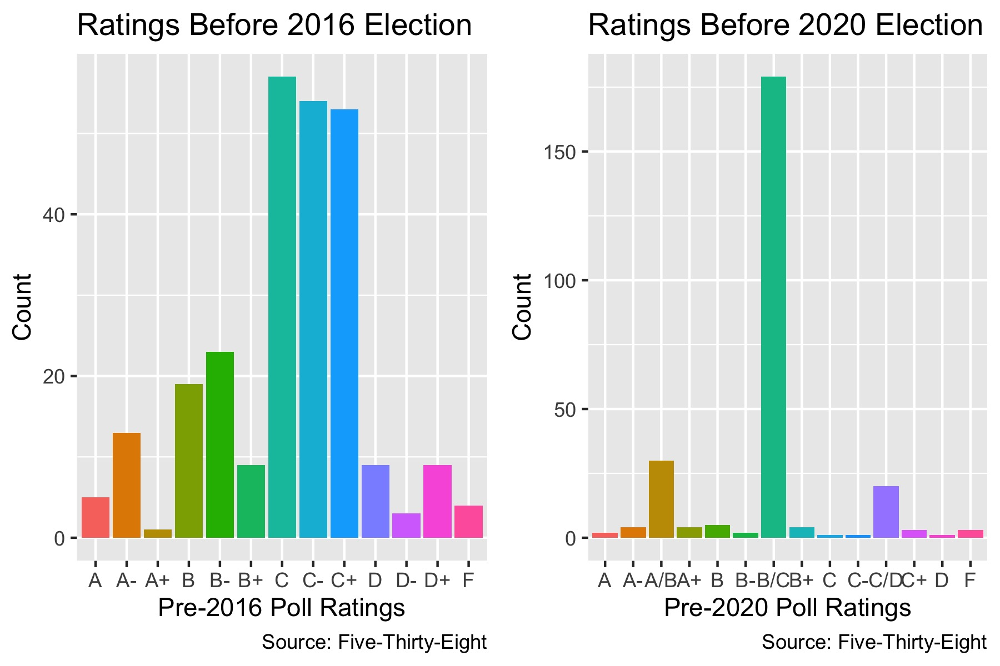
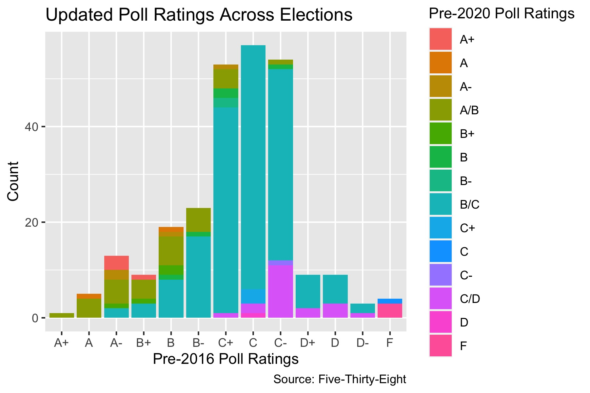

## Polls Ratings in 2016 and 2020

_By Miroslav Bergam_

_September 26th, 2020_

### Differences in Pollster Ratings 

Individually, any given poll has limited power in predicting the outcome of an election. Every poll is subject to a number of [biases and flaws](https://hollis.harvard.edu/primo-explore/fulldisplay?docid=TN_cdi_crossref_primary_10_1038_075450a0&context=PC&vid=HVD2&search_scope=everything&tab=everything&lang=en_US) that can skew its individual prediction; examples include dishonesty or confusion on the part of the respondent, doing a poor job of weighing responses based on likelihood to vote, or non-response bias. However, just as we increase our sample size in a poll or experiment to diminish or cancel out these biases, aggregating many different polls can diminish or cancel out the biases of each individual poll and lead to a more reliable and stable prediction.

To fine tune this approach even more, one should weight the polls they are aggregating based on their reliability. [538](https://projects.fivethirtyeight.com/pollster-ratings/) maintains a record of letter grades for different polls, determined by their accuracy in predicting past elections, their likelihood to favor one party over another, and other factors. 

Seen here is the distribution of 538 poll grades prior to the 2016 election and prior to the 2020 election. As you can see, there was a more diverse distribution prior to 2016, with most polls being graded as "C" but a fair amount of polls ascribed to each letter grade. 2020 looks much different: an overwhelming number of polls are graded "B/C" but far fewer "A" and "B" range grades.

By coloring the distribution of grades for 2016 by the grades for 2020, we can more precisely see how 538 has updated their grades since the last election cycle. As you can see, very few of the As in 2016 retained their grade. The same is true of the Ds, most of which experienced a boost in their grade. These changes are likely due to a combination of two reasons: 538 became more skeptical of several of the highly rated polls following 2016 as many failed to predict Trump's win, and these pollsters updated their methodologies in the last four years correcting for their mistakes in 2016.

### Differences in Pollster Ratings 

