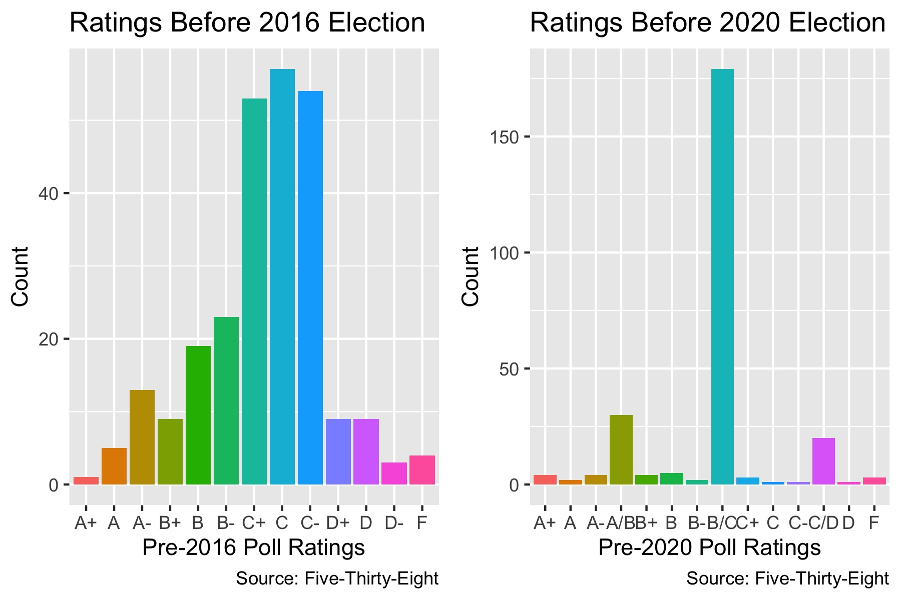

## Polls Ratings in 2016 and 2020

_By Miroslav Bergam_

_September 26th, 2020_

### Differences in Pollster Ratings 

Individually, any given poll has limited power in predicting the outcome of an election. Every poll is subject to a number of [biases and flaws](https://hollis.harvard.edu/primo-explore/fulldisplay?docid=TN_cdi_crossref_primary_10_1038_075450a0&context=PC&vid=HVD2&search_scope=everything&tab=everything&lang=en_US) that can skew its individual prediction; examples include dishonesty or confusion on the part of the respondent, doing a poor job of weighing responses based on likelihood to vote, or non-response bias. However, just as we increase our sample size in a poll or experiment to diminish or cancel out biases and be more sure of our prediction, aggregating many different polls can diminish or cancel out the biases of each individual poll and lead to a more reliable and stable prediction.

To fine tune this approach even more, it's best to weight the polls being aggregated based on their reliability. [538](https://projects.fivethirtyeight.com/pollster-ratings/) maintains a record of letter grades for major polls, determined by their accuracy in predicting past elections, their likelihood to favor one party over another, their size, the type of individuals polled, and other factors. 

This is the distribution of 538 poll grades prior to the 2016 election and prior to the 2020 election. There was a more diverse distribution prior to 2016, with "C" being the mode but a fair amount of polls ascribed to each letter grade. 2020 looks much different: an overwhelming number of polls are graded "B/C" but far fewer "A", "B", and "D" range grades.

By coloring the distribution of 2016 grades by the 2020 grades, we can more precisely see how 538 has updated their grades since the last election cycle. As you can see, very few of the As in 2016 retained their grade. The same is true of the Ds, most of which experienced a boost. These changes are likely due to a combination of two reasons: 538 became skeptical of several highly rated pollsters following 2016 as many failed to predict Trump's win, and that these pollsters updated their methodologies in the last four years by correcting for their mistakes in 2016.

### Predicting 2020 Using Pollster Ratings

To fine-tune a simple aggregate of the polls, we can use these pollster grades to weight each poll's prediction for the outcome of the 2020 election. By doing so, polls conducted by highly rated pollsters have more influence in determining the final prediction than polls by poorly rated pollsters. We will calculate two confidence intervals: one that weights each poll's prediction using the pre-2016 grades, and one that weights each poll's prediction using the pre-2020 grades. 

#### Methodology

To do this, I assigned each pollster grade a number from 1 (F) to 14 (A+). I then bootstrapped 100 samples of 100 polls (with replacement). Within each replicate, the pollster grades (now numerical) were divided by the total sum of the pollster grades. These are used to weight each poll, resulting in one prediction for each replicate of the bootstrap. These 100 predictions are used to determine the final prediction and construct a confidence interval. 

#### Prediction

Using the 2016 pollster grades as weights, it is predicted that Trump will win 42.9% of the popular voteshare, with an lower bound of 42.76% and a upper bound of 43.03%. Using the 2020 pollster grades as weights, the predictions move up by roughly half of a percentage point: 43.35% with a lower bound of 43.23% and a upper bound of 43.51%. 

In 2016, many polls infamously underestimated Trump and falsely predicted Clinton to win. There exists a host of reasons. [One](https://www.mdpi.com/2571-8800/2/1/7) is that polls did a poor job of surveying the less educated, white populations that drove Trump's success because they did not expect them to vote. This could explain why using 2016 weights predicts a lower voteshare for Trump than the 2020 weights, as the highly graded pollsters in 2016 may again have a Democratic lean in their methodologies for this data. 

