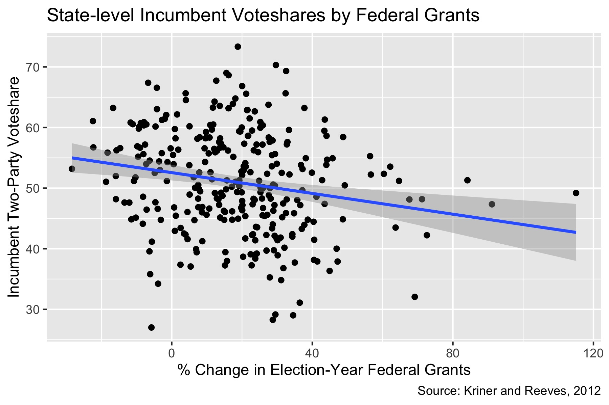

## A Closer Look at the Incumbency Advantage

_By Miroslav Bergam_

_October 2, 2020_

### Introduction

Being the incumbent candidate in a presidential election -- whether that means running for a second term or serving as the candidate for the party that previously held office -- comes with a host of unique factors that do not affect the non-incumbent candidate. Do the sum of these unique factors end up hurting the incumbent? Or do they provide an advantage? 

The most obvious advantage for incumbent candidates is familiarity. The entire country is already familiar with the incumbent candidate, as the four-year media advantage offers nearly universal name recognition. If the candidate is a member of the incumbent party rather than being the direct incumbent, there are similar benefits. The country is already acclimated and familiar with that party's policies, and that candidate is likely endorsed by the previous president, who has the aforementioned name recognition. 

How the incumbent party uses their in office can also lead to an election advantage. One eyebrow-raising tactic is the strategic allocation of federal grants money, also known as "pork". By funneling federal aid to states in the election year, perhaps even targeting states that are likely to swing for one candidate or another, the incumbent party could sway the electorate in their favor. 

There are also some clear disadvantages to being the incumbent or of the incumbent party. One disadvantage is accountability: the incumbent party could be assigned blame for negative changes that transpired in office. These changes could be the fault of poor leadership in office, but they can also be factors that are out of anyone's control, such as an unforeseen recession or a public health crisis. Political polarization may also diminish the benefits of being an incumbent: in states that consistently vote for the same party election after election, incumbency may be far less consequential. For this reason, it will be interesting to investigate the incumbency advantage in swing states, who adhere less strongly to a specific party.

### Exploratory Data Analysis (EDA)

Before we model incumbency, we can perform some exploratory data analysis to help us decide what to include in our model. 

Incumbent candidates or candidates of the incumbent party have a higher average voteshare at the state-level in presidential elections. It's worth taking a closer look at some other variables to determine how strong this advantage is or under what conditions they hold true. 

According to this graph, the benefits of incumbency vary across swing states and non-swing states. For presidential elections since 1984, incumbents have a lessened advantage in swing states. The mean incumbent voteshare in non-swing states is higher than the mean incumbent voteshare in swing states, and is about equal to the 75% percentile incumbent voteshare in swing states. The range is also wider for non-swing states, which is likely due there being fewer swing states.
This trend is perhaps intuitive: because the winning party in swing states changes from election to election, swing state voters may care slightly less about which party holds the title of incumbent. 
It is worth noting that swing states in this dataset are defined by which states were regarded as swing states for each respective election, rather than a singular list being applied across all elections. 

"Pork", as we defined it earlier, seems to have a negligible effect on the incumbent voteshare, at least at the state level. Overall, there is a negative correlation, but it appears to be quite weak based on the spread of the datapoints. 

### Modeling Incumbency

Given the findings of our EDA, I decided to model party incumbency (incumbent), swing state (swing), and percentage change in federal grants from the previous election year (perc_change), as well as the interactions between these variables. I modeled percentage change in pork rather than the raw amount because that is not a consistent scale across all states, as some states have far larger populations and receive more grants by default. Overall, the model has a weak R-squared just shy of 0.1. 

Controlling for the other two variables, there is a significant (p < 0.001) positive correlation of 7.58 percentage points associated with being a member of the incumbent party. 

The interaction between incumbency and swing is significant and negative, with incumbency associated with a 7.75% percentage decrease in the two-party voteshare in swing states. Finally, the change in "pork" from election to election doesn't seem to have a substantial impact on election outcomes. 

Using federal grants and voting data at the county level may better represent the impact of "pork", as voters are more likely to experience the direct effects of federal grant money at the county level. 
