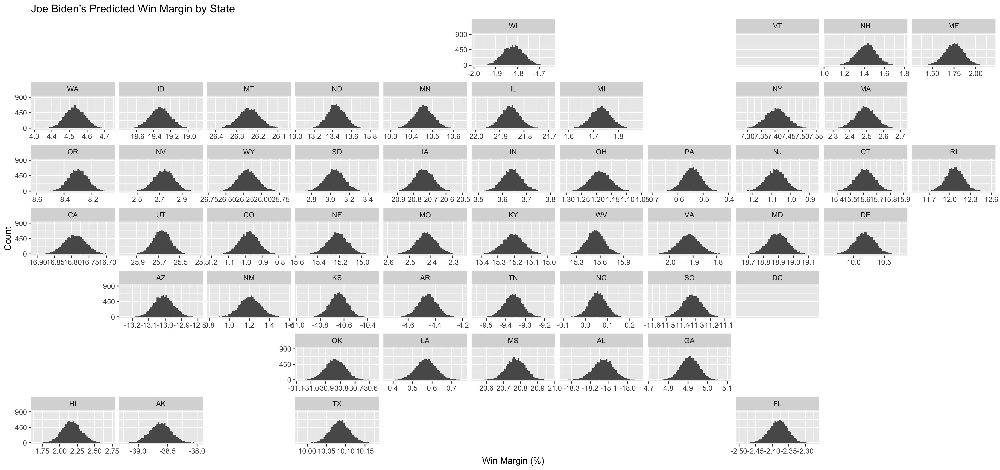

## Predicting 2020 Presidential Election Win Margins

_By Miroslav Bergam_

_October 10, 2020_

### Methodology

Using historical voting data on presidential elections, are we able to predict Vice President Joe Biden's win or loss margin in each state for the 2020 presidential election? 

One way we can tackle this challenge is by creating a model with each state's history of voting for Republican and Democrat candidates, and feeding the most recent 2020 polling data into this model to produce a prediction. However, there are a few changes that can be made to refine this approach. The first is to use a logistic model rather than the typical linear model approach most commonly used on this blog before.   

### Predicted Win Margin in New Jersey 

### Predicted Win Margin in the U.S.

