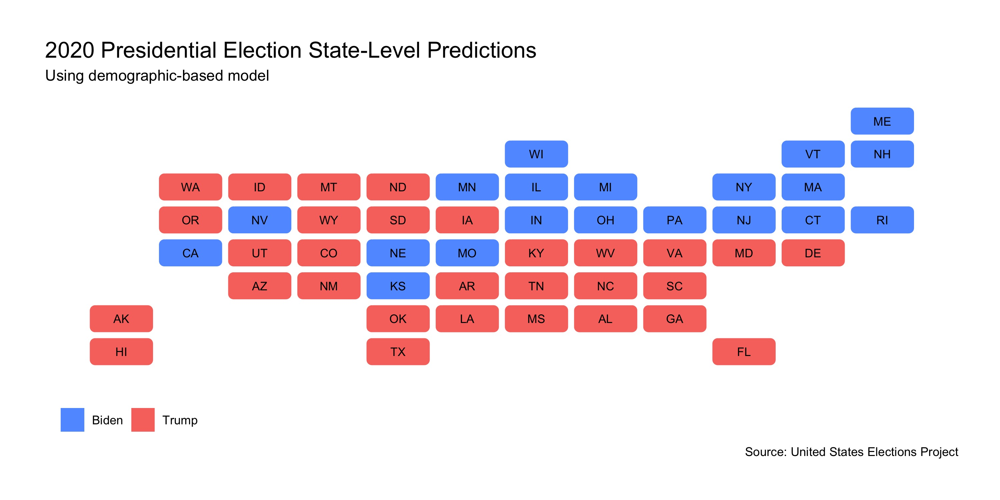
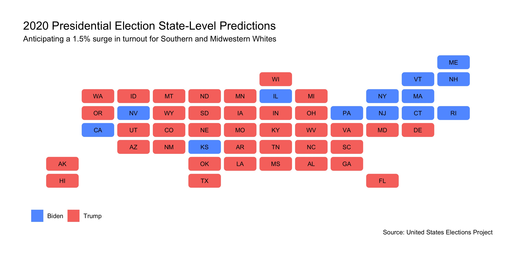

## The Impact of Demographic Changes

_By Miroslav Bergam_

_October 17, 2020_

### Introduction

On this blog, we've explored how polling data, historical voting data, economic fundamental data, and incumbency may influence our prediction of who will win the 2020 presidential election. Can demographic data - that is, data on the volume at which each demographic turns out for elections - be a useful predictor? If a certain demographic "surges", or has an unexpected, abnormally large turnout in 2020, will it lead to a dramatic change in election results? In this blog post, we'll investigate how turnout from different demographics can influence which states each candidate ends up winning.

### A Demographic-Based Model

Source: United States Elections Project

It is very important to note that this model is not generated based on each demographic's history of voting either Democratic and Republican, but rather by how the demographic's changes in turnout has affected which candidate wins each respective state. This is why some of the values in our table are suspect: based on general knowledge of the historical party support of Black Americans, it seems unlikely that an increase in Black turnout would lead to a higher Republican voteshare in their state, even if just by a small amount of 0.18 percentage point. 

Some of these coefficients, however, make sense in context. It comports with our understanding of historical party support that an increase in Southern and White voters would lead to a greater Republican voteshare, while an increase in Hispanic and Northeastern voters would do the opposite. I decided to look at the interaction between `region` and `white_chg`, as White Voters, being such a large voting bloc, vary in their party support largely based on where they live. These coefficients make sense as well: Northeastern Whites decrease Republican support and Southern Whites increase Republican support. 

I postulate that sample size is what leads to the asymmetry in the accuracy of these coefficients. Data on White Americans and vast regions of the country is plentiful. However, when you divide Black Americans, who only [compose 13%](https://www.census.gov/quickfacts/fact/table/US/PST045219) of our national population, across 50 different states, then changes in Black turnout become volatile, arbitrary, and an overall poor predictor of election outcomes. 

### Surge Predictions

This is a map of how the states are predicted to vote in 2020 based on feeding demographic changes since 2016 into the model we created. The plot indeed has some inaccurate predictions. For example, Trump is very unlikely to win Washington and Hawaii. These inaccuracies are likely due to the model limitations discussed in the previous section.

One reason why we use demographic data, as stated in the introduction, is to predict how surges in the turnout of certain demographics may affect election outcomes. In 2016 presidential election, President Trump experienced a unanticipated surge of support from [rural, White Americans](https://www.pewresearch.org/fact-tank/2016/11/17/behind-trumps-win-in-rural-white-america-women-joined-men-in-backing-him/), which is why his win defied the predictions of many reputable pollsters.

For this map, I used our model to predict a surge of 1.5 percentage points of White voter turnout in all Southern and Midwestern states. I did so to emulate the wave of support Trump experienced from White voters in those regions in the previous election. To see a surge of 1.5 points in the White population of each of these states from 2016 is unlikely, particularly because we already saw a jump in voting from this population in 2016. However, if it were to occur, our model predicts that all Midwestern states (except for Illinois, which consistently votes democratic in presidential elections) would flip to Trump.

