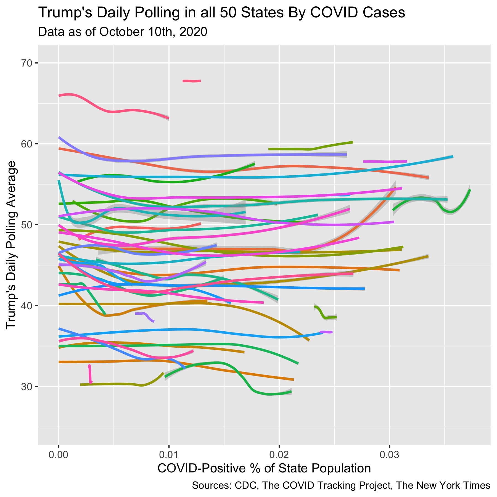

## COVID's Impact on the 2020 Election

_By Miroslav Bergam_

_October 24, 2020_

Shocks in an election cycle can be defined as major events that catch widespread attention and impact how a sizable proportion of individuals may vote. Shocks can range from scandals, such as the release of President Trump's conversation with Billy Bush or James Comey's report on Hillary Clinton, to major events largely out of the control of the President, like foreign threats or natural disasters. Shocks can damage the credibility or likability of candidate, or can be used to ascribe blame to the incumbent candidate for the poor handling of a negative shock. 

No event has more fundamentally changed the lives of citizens in this election cycle than the COVID-19 pandemic. In this blog, we'll explore the effect that the pandemic has had as a shock in this presidential election. We'll use the Trump's state voteshares in the previous election as one predictor to set a baseline for the state, as often the most effective way to predict how someone will vote is how they most recently voted. The percentage of the state population that has had tested positive for COVID on each day will also be a predictor, modelled against Trump's daily poll averages in that state.

The $R^2$ for this model is a very strong 0.922. This can largely be attributed to Trump's voteshares in the 2016 election. As said earlier, the best predictor of how people will vote is how they most recently voted. The 8748 observations consist of each state's polling and COVID statistics each day since the beginning of the pandemic.

Starting from 5.64, the intercept, this model predicts that each point Trump earned in 2016 will translate to 0.78 points this cycle. The `pct_sick_transform` coefficient predicts that each increase of 0.01 in the COVID-positive proportion of a state's population will lead to a 0.56 point loss in Trump's voteshare for that state in 2020. Both coefficients in this model are significant. 

We can take a deeper look at the data to see more precisely how Trump's polling averages have changed as the number of COVID cases increased across the country. 

This plot depicts, for every state, Trump's daily polling average as the percentage of the state population with COVID increases. The y-axis depicts percentage of state population rather than the raw number of cases to put the states of greatly varying sizes on a similar scale. 

It's difficult to pick out trends in this crowded format, so we'll zero in on some specific states next.

The plot on the left highlights the 5 states in which Trump's polling averages were most strongly, negatively correlated with the number of COVID cases. These were determined by adding `state` as an interaction term with `pct_sick_transform` in the model, and picking out the most negative interaction coefficients that were significant.

In each of these states, the downward trend is strong and clear. These states are all moderately to strongly liberal, with none of the polling averages for Trump surpassing 50% at any point. 

The plot on the right depicts the relationship for some of the swing states in the 2020 election. Notably, Trump's polling experienced an initial, dramatic fall for all of these states with the exception of Ohio. However, as the number of COVID cases grew even larger in these swing states, Trump's polling climbed or stabilized. In North Carolina, Florida, Pennsylvania, and Michigan, Trump bounced all the way back to or above his pre-COVID polling numbers. 

These trends indicate that voters reacted strongly to the initial wave of infections, holding Trump accountable as they likely had their first experiences with social distancing and lockdown measures. As the virus progressed through its second wave, however, Trump's polling climbed, either due to his lost supporters assigning their blame for the virus elsewhere or Trump garnering other supporters as the campaign season heated up through the late summer and fall. 

By feeding the most recent COVID totals by state into our model, we can generate this prediction map for who will win each state in the upcoming election.

The difficulty of measuring shocks is isolating their effect. Trump's handling of COVID and the virus' impact on citizens certainly played a role in his mild loss of support over the course of the last several months. However, in such a dramatic campaign cycle where any number of events can be labeled as shocks - from opening of a seat on the Supreme Court to the leak of Trump's tax information - it's difficult to say if COVID was the main driver.
