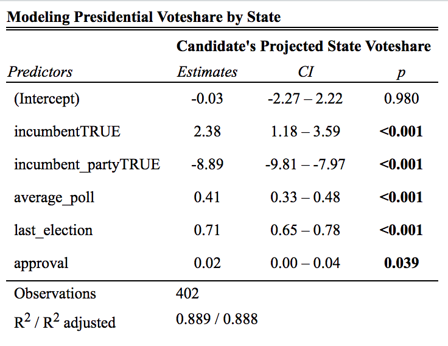
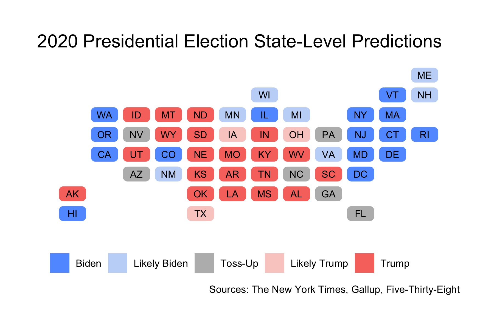

## Final 2020 Presidential Election Prediction

_By Miroslav Bergam_

_November 1st, 2020_

### Introduction

2020 has disrupted the status quo of predicting elections. While a political scientist's instinct is typically to consider as many useful factors as possible in creating a final prediction for a presidential election, the events of this last year, such as a global pandemic that has affected the economy in unprecedented ways, has made typically reliable measures like GDP largely useless as a predictor for this election's outcome. 

The predictors I've decided to use in my final model are whether or not a candidate is incumbent or a member of the incumbent party, their average approval rating in the last few months of their term if they are the incumbent, their polling averages following their party's convention, and the state-level voteshare for their party in the previous election. The formula is as follows: 

`pv2p ~ incumbent + incumbent_party + average_poll + last_election + approval`

I found that these predictors were the most informative in generating a reasonable prediction for the 2020 election. Two predictors I worked with but ended up excluding were economic data and COVID-19 data. I found that the issues of the virus and the economy were better covered by measures like approval rating and polling average, which captures voters' feelings on how President Trump has dealt with the pandemic and its dramatic effects on the economy. I included the state-level outcome of the previous election because one's most recent voting history is a fairly reliable way of predicting how one will vote in the future. Finally, I included whether or not the candidate is an incumbent or a member of the incumbent party because Trump himself is an incumbent candidate.

Overall, our model has a moderately strong in-sample fit, with a R-squared of 0.892. This can be interpreted as our chosen predictors explaining 89.2% of the variation in the state-level voteshares of previous elections. All of our coefficients are statistically significant.  

Incumbent candidates, like President Trump, experience a boost of 2.38 percentage points on average; however, being a member of the incumbent party leads to a loss of 8.89 percentage points on average. This comports with the [earlier findings](posts/blog4.md) on this blog that incumbency comes with both advantages and disadvantages. While being a direct incumbent can boost support for a candidate because of familiarity, a media advantage, and the ability to begin fundraising earlier, members of an incumbent party can also experience a loss of support as voters react to the performance of whoever was previously in office.

Additionally, it finds that each additional point in a candidate's pre-election polling average in a given state leads to a 0.41% increase in their voteshare for that state on average. Each point that a candidate's party won in a given state in the previous presidential election results in a 0.71% increase in their voteshare for that state on average. Finally, each additional 1% of the population that approves of the president prior to the election results in a small boost of 0.2% in their voteshare.

### Predictions

By feeding our model Trump's most recent approval ratings, his polling averages since the first presidential debate, and the state-level outcomes of the 2016 election, I predict this will be the electoral map for the 2020 election:

Based on this map, the states that still may swing in the direction of either candidate are Florida, Georgia, North Carolina, Pennsylvania, Nevada, and Arizona. The outcomes of these states are very important in determining the outcome of the election. With 258 electoral votes certain or very likely to go towards Biden, he is just 12 votes short of winning the presidency. Trump, with 207 electoral votes likely secured, will have to win the majority of these states, particularly Florida and Pennsylvania, to turn the election in his favor. 

Although these swing states may go in either direction, I predict, based on my model, that Biden will win Florida, Pennsylvania, Nevada, and Arizona, and Trump will win Georgia and North Carolina. This would ultimately result in Biden winning the election, with Biden winning 57.8% of electoral votes. 

### Uncertainty

I generated confidence intervals along with my point-estimate predictions on the voteshare for each state in the coming election. You can explore the table below to see the uncertainty surrounding Trump's win and loss margins by state. 

