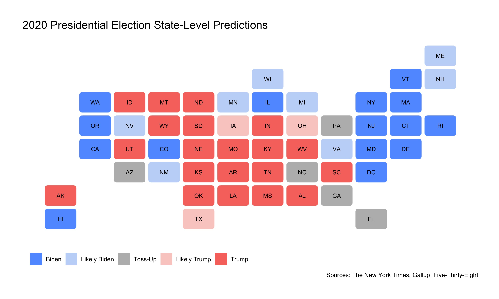

## Final 2020 Election Prediction

_By Miroslav Bergam_

_November 1st, 2020_

2020 has disrupted the status quo of predicting elections. While a data scientist's instinct is typically to consider as many useful factors as possible in creating a final prediction for a presidential election, the events of this last year, such as a global pandemic that has affected the economy in unprecedented ways, has made typically reliable measures like GDP largely useless as a predictor for this election's outcome. 

The predictors I've decided to use in my final model are whether or not a candidate is incumbent or a member of the incumbent party, their average approval rating in the last few months of their term if they are the incumbent, their polling averages following their party's convention, and the outcome for their party in the previous election. The formula is as follows: 

`pv2p ~ incumbent + incumbent_party + average_poll + last_election + approval`

(2) model description and justification, 
(3) coefficients (if using regression) and/or weights (if using ensemble), 
(4) interpretation of coefficients and/or justification of weights, 
(5) model validation (recommended to include both in-sample and out-of-sample performance unless it is impossible due to the characteristics of model and related data availability), 
(6) uncertainty around prediction (e.g. predictive interval)
(7) graphic(s) showing your prediction

Overall, our model has a moderately strong R-squared of 0.892 and all of our coefficients are statistically significant.  Incumbent candidates, like President Trump, experience a boost of 2.38 percentage points on average; however, being a member of the incumbent party leads to a loss of 8.89 percentage points on average. This comports with the earlier findings on this blog that incumbency comes with both advantages and disadvantages. While being a direct incumbent can boost a candidate because the electorate is most familiar with that candidate, among other reasons, members of an incumbent party can also experience a loss of votes as voters react to whoever was previously in office. 

Additionally, it finds that each additional point in a candidate's pre-election polling average leads to a 0.41 increase in their voteshare, on average. 

Based on all of

