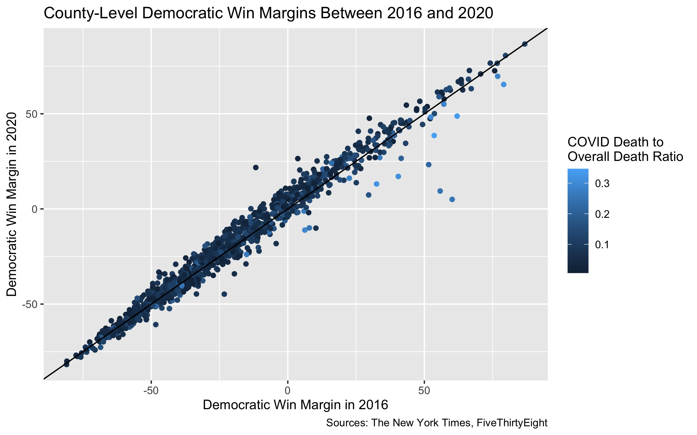
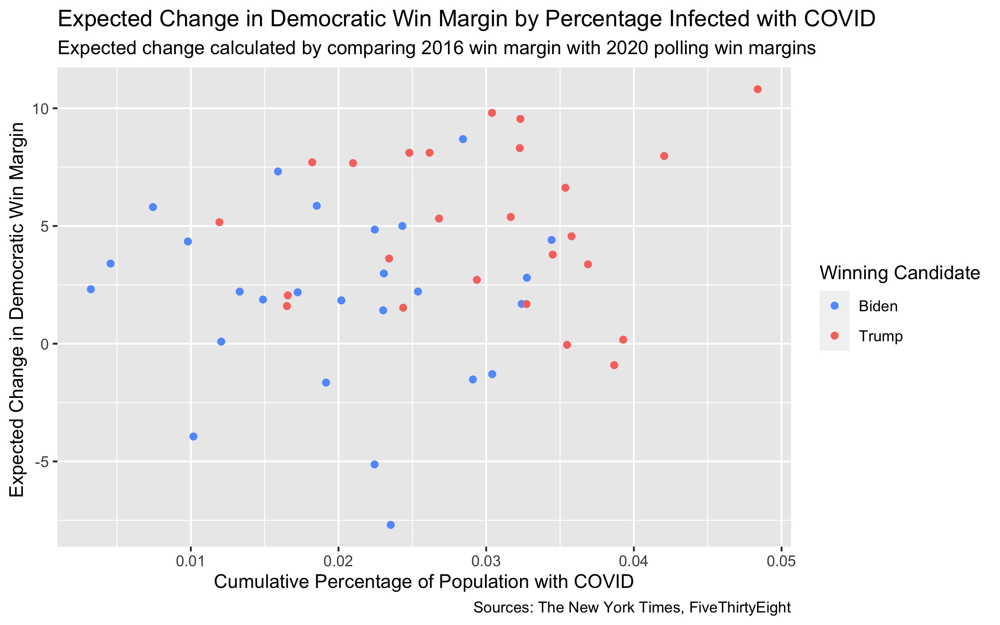

## Election Narrative Analysis: Did COVID-19 Help or Hurt Trump?

_By Miroslav Bergam_

_December 10th, 2020_

A dominant media narrative leading up to the 2020 election was that COVID-19 would lead to Trump's demise. While most were cautious to speak with certainty about such an unprecendeted election, a popular theory leading up to the election was that Trump's management (or mismanagement) of COVID-19 would lead to a loss of support in the electorate. [Major news networks](https://www.bbc.com/news/election-us-2020-54390559) and [publications](https://www.nytimes.com/2020/07/28/upshot/polling-trump-virus-election.html) anticipated this phenomenon. 

A good way to begin exploring this narrative is by comparing the Democratic win/loss margins of 2016 with the margins in 2020, as Trump was a candidate in both elections but COVID-19 was only a factor in the latter. If there aren't any noticeable discrepancies between the win margins on a county level, then COVID-19 likely didn't impact Trump's 2020 presidential run. As you can see, the majority counties voted similarly between 2020 and 2016, following the x=y line. You may notice observe a slight overall shift towards Biden, with more counties falling above than below the x=y line. 

However, there are a handful of counties that fell noticeably below the x=y line, meaning that they swung in the direction of Trump. By coloring counties by their COVID death ratio (the ratio of COVID-related deaths to overall dates between February and October), we can see that these counties were hit particularly hard by COVID, which defies the hypothesis that COVID-19 hurt Trump's chances. To better understand this phenomenon, we can reconfigure the plot and color by the winning party:

This plot, which visualizes the change in the Democratic win margins against the COVID death ratios, makes the counties that changed most dramatically in Democratic win margins more clear. The trend lines show a downward pattern in the change in Democratic win margins as the COVID death ratio increases. This means that Biden lost Clinton voters and Trump mildly gained support in counties that suffered more from COVID-19. The point furthest away from its trendline is [Starr County, Texas](https://www.krgv.com/news/president-donald-j-trump-nearly-wins-starr-county/), where Clinton won 80% of the votes but Biden just barely garnered a majority. 

Indeed, this table tells us that with each increase in 0.1 in the COVID death ratio, there was an average decrease in Democratic support of 3.37% points. The interaction term shows that this effect is mitigated for Republicans, which reflects the Democrat line showing a stronger downward trend in the plot above. 

This doesn't necessarily mean that an increase in COVID deaths had a causal effect on support for Trump. In other words, the relationship may present an ecological fallacy. There are many factors that are [highly correlated](https://www-healthaffairs-org.ezp-prod1.hul.harvard.edu/doi/10.1377/hlthaff.2020.01040) with a high concentration of COVID deaths in a community including income level, race, access to healthcare, and population density. Any of these factors, in addition to efforts in the Trump campaign to appeal to these counties, could instead explain the relationship. Another likely hypothesis is that turnout was lower among Democrats in areas that were hit hardest by the virus, with more COVID-cautious Democrats being less likely to risk a journey to the polls.  

Regardless of the source of the relationship, why did forecasters, the media, and much of the general public believe that Trump's handling of COVID-19 would negatively impact him in the 2020 election when it appears to be the opposite? For starters, the connection is intuitive. Trump [severely mismanaged](https://www.theatlantic.com/magazine/archive/2020/06/underlying-conditions/610261/) the pandemic, failing to treat the public emergency with gravity and shifting the responsibility of lock-downs and regulations to local and state governments. However, a more quantitative answer to this question brings us to the polls:

Because polls are largely unavailable on a county-level, I had to shift my analysis to the states. On the y-axis, I put the expected change in Democratic win margins between 2016 and 2020 - that is, the Democratic state win margins based on most recent poll averages prior to the 2020 election minus the 2016 win margins. I plotted this against the percentage of the population that has cumulatively been infected with COVID. This plot shows a slight upward trend, indicating that the polls anticipated an increase in Democratic support in states that were hit harder by COVID-19. This contributed to the media narrative that the pandemic would hurt Trump; one example is a [New York Times article](https://www.nytimes.com/2020/07/28/upshot/polling-trump-virus-election.html) that predicts a loss of Trump votes as COVID deaths increase. Although we trade off a lot of detail by only looking at states, this implies that polling errors contributed to the media narrative that Trump would be punished for COVID.  

The discrepancy between this trend and the trend we observed earlier - that communities hit hardest by COVID ended up supporting Trump moreso - could be partially explained by the fact that the polls under-predicted support for Trump nationwide, as you can see above. As the COVID-19 pandemic began and communities across the nation locked down, there was a [surge of survey responses from Democrats](https://www.vox.com/policy-and-politics/2020/11/10/21551766/election-polls-results-wrong-david-shor). This could explain why the polls underpredicted Republican support, especially in areas hit hardest by the virus where this Democratic response surge would be exacerbated. All of this may have added to the New York Times and other media outlets claiming that COVID-19 would hurt Trump's support when, in fact, the opposite relationship is observed.
