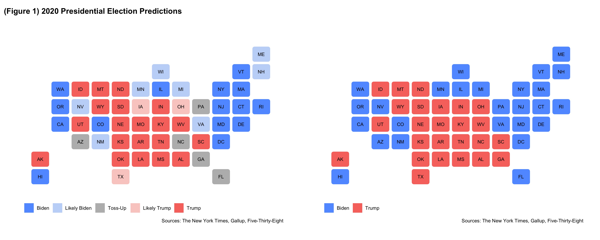

## 2020 Presidential Election Prediction Reflection

_By Miroslav Bergam_

_November 19th, 2020_

Post-election reflection on model

In this assignment, you will create a blog post that assesses your model and discusses how it can be improved.

It should include the following elements:
- A recap of your model(s) and your predictions. 
- A description of the accuracy of the model(s), including any apparent patterns in the accuracy.  Graphics should be used here.
- Proposed hypotheses for why the model(s) were inaccurate in the estimates or locations where it was inaccurate.  These reasons should not simply be statements of about the quality of the components of the model, e.g., “the polls were not good” or “economic growth was not a good predictor” but should instead be grounded hypotheses on why components of the model may not have been predictive or may not have been predictive in certain cases.
- Proposed quantitative tests that could test these hypotheses, e.g., what data, if available, could allow you to test whether the reason proposed really did cause the inaccuracy in your model.  If there is no plausible test of the hypothesis, explain why.  You do not need to perform these tests or explain them in great detail (e.g., there is no need to write down an equation showing your exact test), just propose them.  
- A description of how you might change your model if you were to do it again.  

This blog post may be longer than a typical blog post (remember it accounts for 17.5% of your total grade).  
It is due November 23 by 9PM. 

One source of error was the way in which I incorporated historical voting trends. I believe that, for many states, only using 2016 voteshares worked to my advantage. For example, my correct predictions for Iowa and North Carolina were likely anchored by Trump's win in the two states in 2016. For Georgia, however, Trump's win in 2016 is likely what led to my erroneous prediction for Trump. 

Generally, polling was a source of error for my model, particularly when it came to predicting Florida. Quinnipaic and other predicted Democratic wins in the state of Florida for Hillary Clinton in the 2016 Presidential Election, Andrew Gillum in the 2018 gubernatorial race, Bill Nelson in the 2014 Senate race, and Biden in 2020. All of these were incorrect; Republicans won all four races in Florida. This points to a systemic error in the Democratic direction regarding Florida polls. 

One reason for this could be a higher survey response from Democrats. Regarding this election, David Shorr said that Democrats began responding to polls at higher rates once we entered quarantining months for COVID-19, with the survey response rate for Democrats jumping from 12% to roughly 16%. This may have had a hand in inflating the polling numbers for Biden in Florida and across the country. You may note, however, that even 16% is not a high response rate. In general, low survey response rates are another reason that polling led to be a source of error. This non-response may be accentuated for Republicans, as a means of concealing their controversial political beliefs in a mixed, swing state like Florida. 

Another reason was that polls did a poor job  of choosing a sample that is representative of the electorate. The 2020 presidential election saw record voter turnout on both sides. The unprecedented nature of cycle's turnout poses a difficult challenge for pollsters, who are tasking with choosing a sample that is representative for an electorate that isn't yet fully understood. In Florida, where the data for turnout is availible, there are 1.5% more registered Democrats than Republicans. However, there were 2% more registered Republicans who voted than registered Democrats who voted. This help explains why pollsters underpredicted Trump in Florida: they may not have expected this surge of Republican voters in the state. It's also important to address Trump's surprising performance among Hispanic voters, particularly Cuban-Americans. It was anticipated that Biden would experience a landslide victory within this group, but in the end he may just barely win the Hispanic vote in Florida. 

