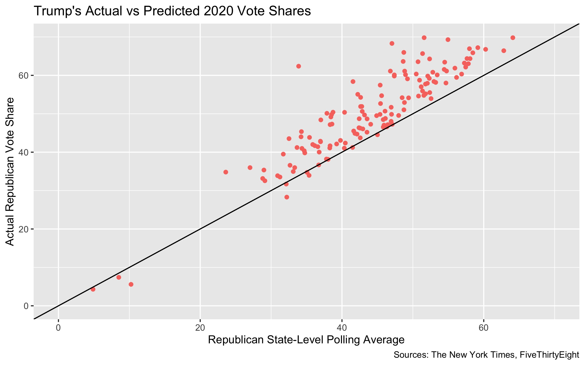

## 2020 Presidential Election Prediction Reflection

_By Miroslav Bergam_

_November 23rd, 2020_

### Model Recap

My election model predicted the two-party vote share of each state based on that each party's vote share in the previous election in that state, each candidate's post-convention polling average, which candidate was the incumbent and/or a member of the incumbent party, the incumbent's latest published national approval rating. I included all Democratic and Republican candidates from the 1988 Presidential Election onward to train my model. The final formula for my model was as follows: 

`pv2p ~ last_election + average_poll + incumbent + incumbent_party + approval`

After feeding my model the 2016 Presidential Election state vote shares, Biden and Trump's post-convention polling averages, Trump's status as the incumbent, and Trump's national approval rating preceding the election, my model predicted the maps below as the outcome of the 2020 Presidential Election. The map on the left demonstrates the levels of certainty for who will win each state and the map on the right shows my final predictions for all states.

### Accuracy

My model erroneously predicted that Trump would win Georgia and Biden would win Florida -- both states in the South that I categorized as toss-ups between the two candidates because my predictions were within 2% of a majority. It also did not consider the split districts of Maine and Nebraska, but this error canceled out in terms of electoral votes as one vote from Maine went to Trump while one vote from Nebraska went to Biden. 

My final electoral vote prediction was 319 Biden to 219 Trump, 13 votes off from the true electoral outcome of 306 Biden to 232 Trump. These 13 votes come from the difference of 13 in Florida and Georgia's number of electors, as I incorrectly predicted each state for the opposite candidate. 

This graph visualizes the accuracy my predictions for Trump's vote share in each state. The black, y = x line signifies a perfect prediction, while the blue line shows the fit of my predictions to the true data. When creating a simple linear model between my model's predictions for Trump and his true vote share by state, my predictions had a coefficient of 0.91 and intercept of 5.1. The R-squared for this fit was 0.985, meaning that 98.5% of the true state vote shares were explained by my predictions. The point that strays farthest from the line of best fit is New York, which is very likely because the state has only reported 84% of votes at this time. 

Additionally, my model had an RMSE of 1.969 and a Brier Score of 3.876. The RMSE measures the standard deviation of the residuals, or the the variation in my error margins for each state. Brier score is a similar measure of accuracy, simply being RMSE raised to the second power. 

### Source of Error

I hypothesize that polling inaccuracy and the use of short-term historical voting trends were my model's sources of error. 

Because Trump narrowly won Florida in 2016, it is most likely Trump's low polling average of 46.9% led to my incorrect prediction of Biden winning. [Quinnipiac, along with many other notable pollsters, predicted Democratic wins](https://news.wjct.org/post/look-why-florida-presidential-polls-were-wrong) in the state of Florida for Hillary Clinton in the 2016 Presidential Election, Andrew Gillum in the 2018 gubernatorial race, Bill Nelson in the 2014 Senate race, and President-Elect Biden in this election. All of these were incorrect, as the Republican candidate won all four of these races in Florida. This consistency points to a systemic bias in the Democratic direction regarding Florida polls. This Democratic lean is not limited to the state of Florida:

The graph above displays the pre-election polling averages for each state in the 2012, 2016, and 2020 elections plotted against the state's true Republican vote shares. The majority of the points being to the left of the y = x line demonstrates how pollsters in 2012, 2016, and 2020 have consistently under-predicted the vote shares of Republican candidates. My other predictors did not successfully cancel out this polling error for Florida in 2020.

One reason for this Democratic polling bias in Florida and across the country for this election cycle may have been a disproportionately high survey response rate from Democrats. As the COVID-19 pandemic began and individuals spent their springs and summers in quarantine, [Democrats began to engage with polls and surveys at much higher rates](https://www.vox.com/policy-and-politics/2020/11/10/21551766/election-polls-results-wrong-david-shor). By connecting survey responses to voter files, it was revealed that there was a surge of survey responses from individuals who were linked to other Democratic institutions, such as being regular ActBlue donors. This phenomenon likely played a heavy hand in inflating polling numbers for Biden. I theorize that the opposite effect was present for Republican voters: the effect of voters falsifying their true preference for Trump due to social pressure and a lower civic engagement with polls and surveys deflated the true support for Trump in the state. 

Another reason for the Democratic polling bias was pollsters did a poor job of choosing a sample that is representative of the electorate. The 2020 Presidential Election saw record voter turnout on both sides. The unprecedented turnout of this cycle poses a difficult challenge for pollsters, who are tasked with choosing a sample that is representative for an electorate that wasn't yet fully understood. For example, the polling error. This may have been a factor in Trump's surprising performance among Hispanic voters, particularly Cuban-Americans. It was anticipated that Biden would experience a landslide victory within this group, but in the end he may just barely win the Hispanic vote in Florida. If the preferences of this group properly 

Another source of error was the way in which I incorporated historical voting trends. I believe that, for many states, using just the 2016 vote shares worked to my model's advantage. For example, my correct predictions for Iowa and North Carolina were likely anchored by Trump's win in the two states in 2016. For Georgia, however, Trump's win in 2016 is likely what led to my incorrect prediction for Trump. The poll averages I incorporated predicted a narrow win for Biden in Georgia, which abets my theory that the 2016 vote shares offset this specific prediction. 

### Discussion

If I were to redo my model, I would more aggressively vet, discard, and weight polls based on their 538 grades and previous accuracy, rather than averaging all polls like my model did. By more heavily weighting pollsters that have accurately predicted difficult-to-poll states like Florida in the past and discarding pollsters with a significant partisan lean, I may have been able to diminish the negative effect of the exaggerated polling for Biden.

As you can see in figure 4, pollsters since 2012 have consistently under-predicted Republican state vote shares in presidential elections. Another change I would make to my model is transforming the polling data, shifting it a couple of points in the Republican direction to account for the highly consistent Democratic bias in recent elections, or exclude polls with the strongest Democratic leans.

- Proposed hypotheses for why the model(s) were inaccurate in the estimates or locations where it was inaccurate.  These reasons should not simply be statements of about the quality of the components of the model, e.g., “the polls were not good” or “economic growth was not a good predictor” but should instead be grounded hypotheses on why components of the model may not have been predictive or may not have been predictive in certain cases.

- Proposed quantitative tests that could test these hypotheses, e.g., what data, if available, could allow you to test whether the reason proposed really did cause the inaccuracy in your model.  If there is no plausible test of the hypothesis, explain why.  You do not need to perform these tests or explain them in great detail (e.g., there is no need to write down an equation showing your exact test), just propose them.

November 23 by 9PM. 

